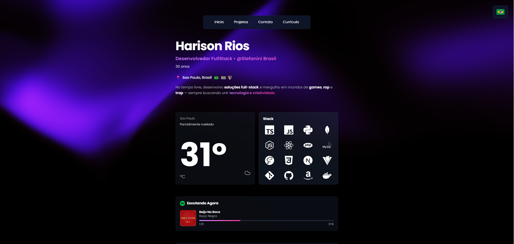

# Hari 🚀



Portfolio profissional com foco em apresentacao, projetos e contato.

## O que tem aqui
- Home com apresentacao, stack e destaques profissionais
- Projetos com informacoes objetivas
- Contato para propostas e parcerias
- Curriculo em PT/EN
- Layout responsivo

## Rodando local
1. Instale as dependencias
   ```bash
   npm install
   ```
2. Suba o dev server
   ```bash
   npm run dev
   ```
3. Acesse
   ```
   http://localhost:3000
   ```

## Build
```bash
npm run build
npm start
```

## License
Copyright (c) 2026 Harison Rios. All rights reserved.

## Autor
**Harison Rios**
- GitHub: https://github.com/HarisonRios
- LinkedIn: https://linkedin.com/in/harisonrios
- Email: mailto:hharison562@gmail.com
